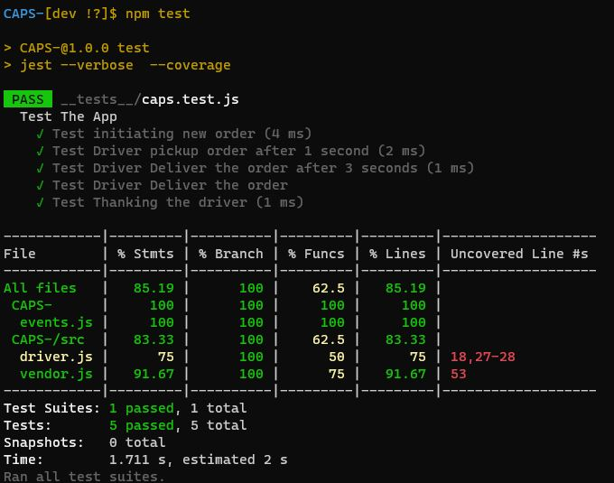
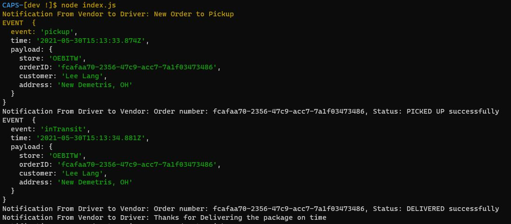
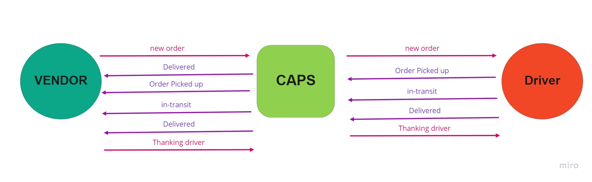

# CAPS

CAPS Phase 1: Begin the build of an application for a company called CAPS - The Code Academy Parcel Service. In this sprint, we’ll build out a system that emulates a real world supply chain. CAPS will simulate a delivery service where vendors (such a flower shops) will ship products using our delivery service and when our drivers deliver them, be notified that their customers received what they purchased.

Tactically, this will be an event driven application that “distributes” the responsibility for logging to separate modules, using only events to trigger logging based on activity.

## Author: Omar Ewies
* [Tests Report](https://github.com/oebitw/CAPS-/actions)

* [Pull Request](https://github.com/oebitw/CAPS-/pull/1)

## Setup

1) Clone the repo
2) npm init -y.
3) npm install.
4) Create .env file with STORE_NAME= whatever_you_want.

## Test
* npm test

## Run the app
* node index.js

## UML

